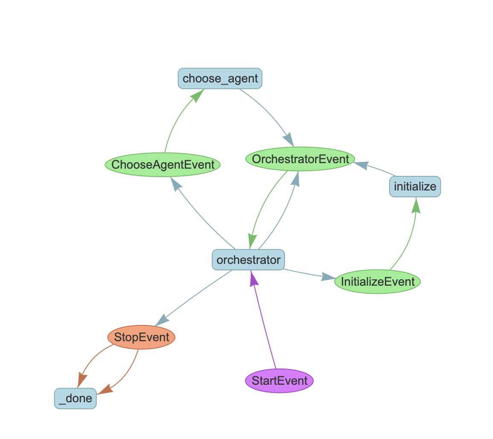

# Multi-agent orchestrator

This repo contains implementations of the multi-agent orchestrator system using LlamaIndex's Workflows. The file `main.py`, is the entrypoint.

The resulting workflow is rendered automatically using the built-in `draw_all_possible_flows()` and looks like this:



## Vscode Config

```json
  "flake8.args": ["--max-line-length=110", "--extend-ignore", "E203"],
  "black-formatter.args": ["--line-length", "110"],
  "[python]": {
    "editor.defaultFormatter": "ms-python.black-formatter",
    "editor.formatOnSave": true,
    "editor.codeActionsOnSave": {
      "source.organizeImports": true
    }
  }
```

## Setup redis

```sh
brew install redis
redis-server
brew services start redis
brew services stop redis

# GUI to explore redis
brew install --cask another-redis-desktop-manager
```
